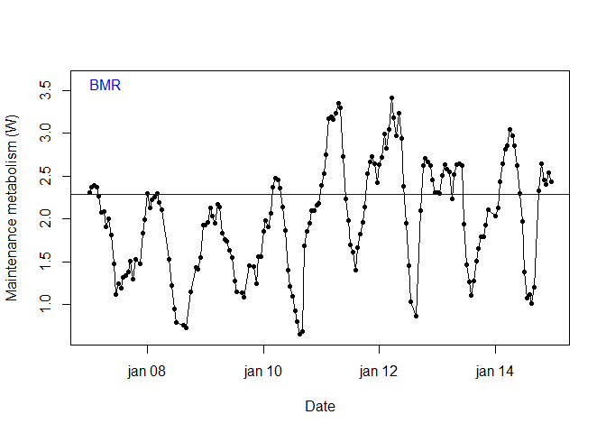

<!-- README.md is generated from README.Rmd. Please edit that file -->
eneRgetics
==========

[](https://doi.org/10.5281/zenodo.7827606) [](https://www.repostatus.org/#active) [](https://coveralls.io/r/CamiloCarneiro/eneRgetics)

eneRgetics provides a fast and straightforward way to calculate the Maintenance Metabolism of shorebirds. It has functions to retrieve the necessary environmental data to calculate it, to retrieve tidal data and to create categories for the tide state in relation to low tide. Additionally, it provides a function to calculate the Basal Metabolic Rate of shorebirds.

Installation
------------

``` r
devtools::install_github("CamiloCarneiro/eneRgetics")
```

``` r
library("eneRgetics")
```

Getting started with eneRgetics
-------------------------------

eneRgetics was created to provide a fast and straightforward way to estimate the thermoregulation costs and maintenance metabolism of shorebirds (`mmaint()`), following the model by Wiersma & Piersma (1994). It provides functions to: retrieve the necessary environmental data from web sources (`get_weather()`) to calculate the maintenance metabolism; retrieve tidal data from the web (often useful, given many shorebirds move between microhabitats in accordance with tides (`get_tides()`); and to classify tide states in relation to low tide (`tidal_codes()`). Given that thermoregulation only incurs costs when maintenance metabolism is higher than the Basal Metabolic Rate, we provide a function to calculate it (`bmr()`), following Kersten & Piersma (1987) and Kersten et al. (1998).

Please note that `get_weather()` and `get_tides()` require user registration on-line. The free registration option allows for the download of a large volume of data. See the functions details and the respective websites for more information.

In the following example, we will exemplify how the functions in eneRgetics can be used.

Explanatory exercise
--------------------

Imagine we want to estimate the maintenance metabolism of the Whimbrel (*Numenius phaeopus*) for a period of time during the non-breeding season of 2016-2017 in the Banc d'Arguin, Mauritania (latitude N19.9,longitude W16.3). Let's assume that period to be from 7 to 14 January 2017. During the non-breeding season whimbrels usually forage in intertidal areas at low tide and during high tide roost in flocks above the high tidemark. Hence, their microhabitat use will vary in relation to the tide (*e.g.* being in open tidal flats while foraging and roosting in less exposed habitats the rest of the time).

We need the following data to calculate their maintenance metabolism:
**I.** Time budget: the proportion of time spent at each microhabitat per tide state (*e.g.* at each hour in relation to low tide; microhabitats from Wiersma & Piersma (1994));
**II.** Weather: temperature, wind, solar irradiance;
**III.** Tide table;
**IV.** Whimbrel body mass and breast height.

### 1. Field data

First we need to know how much time whimbrels spend on each microhabitat. Microhabitat use is related to their activity (*e.g.* foraging during low tide in open tidal flats or roosting during high tide). To do so, we have recorded the percentage of birds on each activity, at given time intervals - in this case the proportion of birds roosting and not roosting (*i.e.* foraging, preening, interacting) - over the course of the non-breeding season. We end up with the following type of data:

``` r
load("data/time_budget.rda")
```

    #>         date  time perc_roosting perc_not_roosting
    #> 1 2017-01-05 08:25          0.27              0.73
    #> 2 2017-01-05 08:45          0.36              0.64
    #> 3 2017-01-05 09:15          0.74              0.26
    #> 4 2017-01-05 09:30          0.86              0.14
    #> 5 2017-01-05 09:45          0.87              0.13
    #> 6 2017-01-05 10:00          0.62              0.38

### 2. Summarising data

Following Altmann (1974), we assume that the average percentage of individuals in a given activity during an interval is similar to the amount of time an average individual spends on that activity in the same interval. Hence, we now need to summarise all our observations in order to calculate the average time spent on each activity and, consequently, on each microhabitat. Given that whimbrels follow a tidal cycle, we will do so in relation to the tidal state. Using `tidal_codes()` we can calculate the time to the nearest low tide for each observation and then use those codes to summarise the data. In order to do so, we need a tide table for our study location and for the period of the observations. This can be obtained using `get_tides()`.

``` r
# note that `tidal_codes()` requires that our data has datetime stamp in POSIXct with time zone information
time_budget$date <- as.POSIXct(paste(time_budget$date, time_budget$time),
                               format = "%Y-%m-%d %H:%M", tz = "GMT")

time_budget <- time_budget[, -2] #remove column 'time'
```

    #>                  date perc_roosting perc_not_roosting
    #> 1 2017-01-05 08:25:00          0.27              0.73
    #> 2 2017-01-05 08:45:00          0.36              0.64
    #> 3 2017-01-05 09:15:00          0.74              0.26
    #> 4 2017-01-05 09:30:00          0.86              0.14
    #> 5 2017-01-05 09:45:00          0.87              0.13
    #> 6 2017-01-05 10:00:00          0.62              0.38

The observations were made between 2017-01-05 and 2017-02-01 in order to represent the non-breeding behaviour/microhabitat use, so we will retrieve tidal data for the same period.

``` r
latitude <- 19.9
longitude <- -16.3
start <- "2017-01-05"
end<-"2017-02-01"
time_zone <- "GMT"
key <- "write_worldtides_key_here"

tides_jan <- get_tides(lat = latitude, lon = longitude, start_date = start, end_date = end,
                       tzone = time_zone, API_key = key)
```

To create the tide codes, we run:

``` r
time_budget_with_code <- tidal_codes(time_budget, tides_jan)
```

And we get the previous data frame with the additional *tide\_code* column (*i.e.* the time to the nearest low tide in hours):

    #>                  date perc_roosting perc_not_roosting tide_code
    #> 1 2017-01-05 08:25:00          0.27              0.73        -4
    #> 2 2017-01-05 08:45:00          0.36              0.64        -4
    #> 3 2017-01-05 09:15:00          0.74              0.26        -3
    #> 4 2017-01-05 09:30:00          0.86              0.14        -3
    #> 5 2017-01-05 09:45:00          0.87              0.13        -3
    #> 6 2017-01-05 10:00:00          0.62              0.38        -2

There are many ways to summarise the data. Here we use the `dplyr` package.

``` r
require(dplyr)
summary_data <- time_budget_with_code %>%
  group_by(tide_code) %>%
  summarise(n_observations = length(tide_code),
            mean_roosting  = mean(perc_roosting, na.rm = T),
            mean_not_roosting  = mean(perc_not_roosting, na.rm = T))
```

    #>   tide_code n_observations mean_roosting mean_not_roosting
    #> 1        -6             29     0.8603448         0.1396552
    #> 2        -5             52     0.6388462         0.3611538
    #> 3        -4             59     0.4333898         0.5666102
    #> 4        -3             51     0.2715686         0.7284314
    #> 5        -2             44     0.1920455         0.8079545
    #> 6        -1             40     0.1695000         0.8305000

Now we know the proportion of time that the Whimbrel spend, on average, in each microhabitat at hourly intervals in relation to the tide.

### 3. Retrieving weather data

To calculate the maintenance metabolism we need weather data (namely air temperature, wind speed and solar irradiation). Using `get_weather()` we can retrieve such data from the web (see function details for more info).

``` r
cams_user <- "write_email@here.com"
API_key <- "write_darksky_API_key_here"
latitude <- 19.9
longitude <- -16.3
start_date <- "2017-01-07"
end_date<-"2017-01-14"
reli_score <- 0.5
time_zone <- "GMT"

weather_jan <- get_weather(lat = latitude, lon = longitude, start_date = start_date, end_date = end_date,
                           tzone = time_zone, reli_score = reli_score, API_key = API_key,
                           cams_user = cams_user)
```

We get a data frame with the following structure:

    #>                  date temperature wind_speed GHI
    #> 1 2017-01-07 02:00:00       17.78       3.58   0
    #> 2 2017-01-07 03:00:00       17.22       3.58   0
    #> 3 2017-01-07 04:00:00       17.22       4.02   0
    #> 4 2017-01-07 05:00:00       16.11       3.13   0
    #> 5 2017-01-07 06:00:00       16.11       2.68   0
    #> 6 2017-01-07 07:00:00       17.22       2.68   0

### 4. Calculating maintenance metabolism

Now we have all the required input to calculate the hourly maintenance metabolism (*m\_maint*). Following Wiersma and Piersma (1994), we assume the microhabitats used during roosting and not roosting periods were h8 (Open group) and h3 (Mudflat and bare salt marsh), respectively, and therefore use the respective habitat specific formulae. Note that other microhabitats are available in order to accommodate different microhabitat use. The time budget data frame needs to be formatted accordingly to be used by `mmaint()`. Given that thermoregulation costs only occur when *m\_maint* is higher than BMR, if BMR is calculated beforehand (or present in the R environment) the plot produced by `mmaint()` shows it as a horizontal line. The plot shows the initial 360 data points (ca. 15 days) in the dataset and prints the range of *m\_maint* values, in order to allow an assessment of the results produced.

``` r
# preparing the time budget data frame
names(summary_data)[names(summary_data) == "mean_not_roosting"] <- "h3"
names(summary_data)[names(summary_data) == "mean_roosting"] <- "h8"

summary_data <- summary_data[,c("tide_code","h3","h8")]

# calulating BMR
body_mass <- 460
region <- "trop"

BMR<-bmr(body_mass = body_mass, region = region)

# calculating maintenance metabolism
weatherData <- weather_jan
tide_table <- tides_jan
time_budget <- summary_data
breast_height <- 0.17

Maintenance_metabolism <- mmaint(weatherData = weatherData, tide_table = tide_table,
                                 timeBudget = time_budget, breast_height = breast_height,
                                 body_mass = body_mass)
```

    #>   tide_code                date temperature wind_speed      GHI        h3
    #> 1        -6 2017-01-08 10:00:00       20.00       0.89 348.7451 0.1396552
    #> 2        -6 2017-01-14 03:00:00       17.22       8.94   0.0000 0.1396552
    #> 3        -6 2017-01-12 01:00:00       17.22       9.83   0.0000 0.1396552
    #> 4        -6 2017-01-09 11:00:00       22.22       4.47 206.6119 0.1396552
    #> 5        -6 2017-01-07 21:00:00       21.11       0.89   0.0000 0.1396552
    #> 6        -6 2017-01-07 09:00:00       17.78       3.13 208.4848 0.1396552
    #>          h8 h1 h2 h4 h5 h6 h7 h9 h10 h11  m_maint
    #> 1 0.8603448  0  0  0  0  0  0  0   0   0 1.225394
    #> 2 0.8603448  0  0  0  0  0  0  0   0   0 2.643775
    #> 3 0.8603448  0  0  0  0  0  0  0   0   0 2.722218
    #> 4 0.8603448  0  0  0  0  0  0  0   0   0 1.547975
    #> 5 0.8603448  0  0  0  0  0  0  0   0   0 1.479549
    #> 6 0.8603448  0  0  0  0  0  0  0   0   0 1.814515

    #> [1] "m_maint range: 0.651 - 3.41"



### 5. What if microhabitat use does not vary according to tides?

Suppose the Whimbrel do not vary on the microhabitat use in relation to the tidal rhythm but that their use of each microhabitat is constant each day, as the following:

``` r
load("data/time_budget_no_tides.rda")
head(time_budget_no_tides)
#>     h3   h8
#> 1 0.58 0.42
```

In such case, we provide that information to `mmaint()`, with no tide\_table argument:

``` r
weatherData <- weather_jan
time_budget <- time_budget_no_tides
breast_height <- 0.17
body_mass <- 460

Maintenance_no_tides <- mmaint(weatherData = weatherData, timeBudget = time_budget,
                               breast_height = breast_height, body_mass = body_mass)
```

    #>                  date temperature wind_speed GHI h1 h2   h3 h4 h5 h6 h7
    #> 1 2017-01-07 02:00:00       17.78       3.58   0  0  0 0.58  0  0  0  0
    #> 2 2017-01-07 03:00:00       17.22       3.58   0  0  0 0.58  0  0  0  0
    #> 3 2017-01-07 04:00:00       17.22       4.02   0  0  0 0.58  0  0  0  0
    #> 4 2017-01-07 05:00:00       16.11       3.13   0  0  0 0.58  0  0  0  0
    #> 5 2017-01-07 06:00:00       16.11       2.68   0  0  0 0.58  0  0  0  0
    #> 6 2017-01-07 07:00:00       17.22       2.68   0  0  0 0.58  0  0  0  0
    #>     h8 h9 h10 h11  m_maint
    #> 1 0.42  0   0   0 2.227418
    #> 2 0.42  0   0   0 2.281137
    #> 3 0.42  0   0   0 2.344780
    #> 4 0.42  0   0   0 2.317329
    #> 5 0.42  0   0   0 2.244460
    #> 6 0.42  0   0   0 2.144366

### 6. Important note

In the current version, the geographical coverage of `get_weather()` is spatially restricted to -66 and 66 degrees latitude and longitude, and has a temporal coverage starting in 2004-02-01 and ending 2 days prior to the data retrieval.

### References

Altmann, J. 1974. Observational Study of Behavior: Sampling. - Behaviour 49: 227-267.

Kersten, M., Bruinzeel, L., Wiersma, P. & Piersma, T. 1998. Reduced basal metabolic rate of migratory waders wintering in coastal Africa. - Ardea 86: 71-80.

Kersten, M. & Piersma, T. 1987. High Levels of Energy Expenditure in Shorebirds; Metabolic Adaptations to an Energetically Expensive Way of Life. - Ardea 75: 175-187.

Wiersma, P. and Piersma, T. 1994. Effects of microhabitat, flocking, climate and migratory goal on energy expenditure in the annual cycle of red knots. - Condor 96: 257 - 279.


### Recommended citation
Carneiro, C., Correia R. & Alves J. A. (2023). eneRgetics: Estimates the Maintenance Metabolism of shorebirds. R package version  0.0.0.9000. https://github.com/CamiloCarneiro/eneRgetics/
